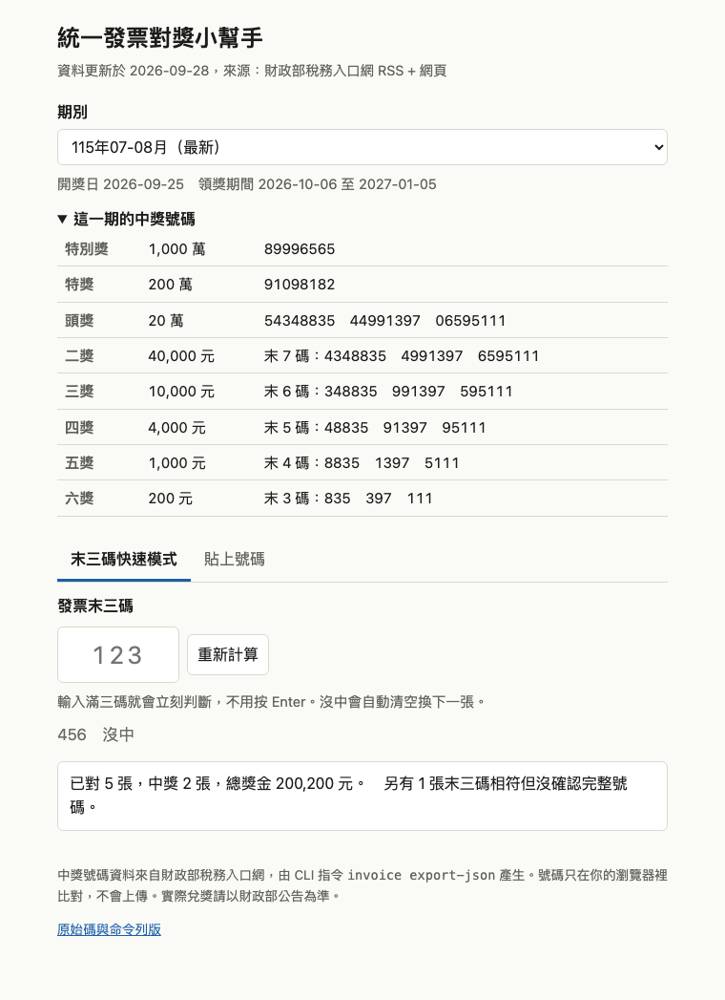

# 統一發票對獎小幫手
Check Taiwan uniform invoice (統一發票) lottery numbers from the terminal or a static web page.



## 這是什麼

統一發票每兩個月開一次獎。這個專案幫你：從財政部稅務入口網抓最新中獎號碼，然後在終端機或網頁上對獎。不用註冊、不用 API 金鑰，除了抓號碼之外不會連網，你的發票號碼不會傳到任何地方。

- 命令列版（Python，只用標準函式庫）：`invoice`
- 網頁版（純前端、沒有 CDN）：<https://useless-husband.github.io/invoice-lottery-tw/>

## 功能

- 抓最新中獎號碼：先讀財政部 RSS，失敗就改讀網頁；結果快取在使用者快取目錄，網路不通時用快取並提示
- 依現行規定判斷獎項，同一張發票只給最高獎（見下方獎項表）
- 由發票日期判斷屬於哪一期，顯示開獎日與領獎期間；對錯期、尚未開獎、已過領獎期限的發票會提醒
- `invoice quick`：只打末三碼，馬上告訴你沒中或「可能中獎」，再輸入完整號碼確認
- `invoice batch`：整份 CSV 一次對完，列出中獎清單與總獎金
- `invoice export-json`：輸出中獎號碼 JSON，給網頁版使用

## 獎項規則

依據：財政部「統一發票給獎辦法」與財政部稅務入口網（<https://invoice.etax.nat.gov.tw/>）公布的中獎號碼單，2026 年 9 月查證。

| 獎項 | 獎金 | 比對方式 |
| --- | ---: | --- |
| 特別獎 | 10,000,000 | 8 碼全對特別獎號碼 |
| 特獎 | 2,000,000 | 8 碼全對特獎號碼 |
| 頭獎 | 200,000 | 8 碼全對任一組頭獎號碼 |
| 二獎 | 40,000 | 末 7 碼與任一組頭獎號碼相同 |
| 三獎 | 10,000 | 末 6 碼 |
| 四獎 | 4,000 | 末 5 碼 |
| 五獎 | 1,000 | 末 4 碼 |
| 六獎 | 200 | 末 3 碼 |

- 二獎到六獎是拿「頭獎號碼」的末幾碼來比，特別獎、特獎的末幾碼不算。
- 同時符合多個獎項只能領一個（最高的）。例如中頭獎的號碼也符合二～六獎，只算頭獎的 20 萬。
- 開獎日是單數月 25 日（例如 115 年 07-08 月在 9 月 25 日開獎）；領獎期間從開獎後次月 6 日起算三個月（該期為 2026-10-06 至 2027-01-05）。
- 增開六獎：目前財政部公布的號碼單與 RSS 都沒有這個項目（2026 年 9 月查證），所以預設不會出現。程式仍保留支援：如果來源資料裡有「增開六獎」三碼號碼，末三碼相符就是 200 元。這部分只用人工編造的資料測過，沒有真實開獎資料可驗證。
- 提醒：中三獎（含）以上要扣 20% 所得稅，中五獎以上另有印花稅規定，詳見財政部說明。實際兌獎以官方公告為準。

## 安裝與執行

需要 Python 3.10 以上。先在終端機打 `python3 --version` 確認版本。

### 方法一：pipx（推薦）

```bash
pipx install git+https://github.com/useless-husband/invoice-lottery-tw
invoice --version
```

還沒有 pipx 的話，macOS 可以先 `brew install pipx`，或改用方法二。

### 方法二：uv

```bash
uv tool install git+https://github.com/useless-husband/invoice-lottery-tw
invoice --version
```

### 方法三：下載原始碼直接跑（不用安裝）

```bash
git clone https://github.com/useless-husband/invoice-lottery-tw
cd invoice-lottery-tw
python3 -m invoice_lottery numbers
```

以下範例都用 `invoice` 指令；方法三請把 `invoice` 換成 `python3 -m invoice_lottery`。

## 使用範例

### 看最新一期號碼

```console
$ invoice numbers
115年07-08月（115-07/08）
開獎日 2026-09-25（五）　領獎期間 2026-10-06 至 2027-01-05

特別獎  10,000,000 元  89996565
特獎     2,000,000 元  91098182
頭獎       200,000 元  54348835  44991397  06595111
二獎        40,000 元  末7碼  4348835  4991397  6595111
三獎        10,000 元  末6碼  348835  991397  595111
四獎         4,000 元  末5碼  48835  91397  95111
五獎         1,000 元  末4碼  8835  1397  5111
六獎           200 元  末3碼  835  397  111
```

指定期別用民國年：`invoice numbers --period 115-05/06`（`11505`、`115年05-06月` 也可以）。官方 RSS 只提供最近 6 期。

### 對單張

```console
$ invoice check 12345111
對獎期別：115年07-08月（115-07/08）
12345111  中獎！五獎　1,000 元

$ invoice check AB-54348835 --period 115-07/08 --date 2026-05-03
提醒：這張發票日期 2026-05-03 屬於 115-05/06，不能拿來對 115-07/08。
```

號碼可以帶字軌（`AB-12345678`）。加 `--date` 會檢查日期是否屬於那一期；不加 `--period` 只給 `--date` 時，會自動用日期所屬的期別。結束碼：`0` 中獎、`1` 沒中、`2` 輸入錯誤或錯期，可以直接寫在 shell 腳本裡。

### 快速模式：只打末三碼

```console
$ invoice quick
快速對獎：115年07-08月　只要輸入發票末三碼再按 Enter；q 離開。
末三碼> 123
  沒中
末三碼> 835
  可能中獎！ 請輸入完整 8 碼（或前 5 碼，Enter 略過）
完整號碼> 54348835
  中獎！頭獎 200,000 元  (54348835)
末三碼> q

共對了 2 張，中獎 1 張，總獎金 200,000 元。
```

- 大部分發票打完三碼按 Enter 就是「沒中」，立刻換下一張。
- 出現「可能中獎」時，輸入完整 8 碼（或只打前 5 碼也行）確認實際獎項。
- 在完整號碼那一格直接按 Enter 是略過；結束時會告訴你有幾張還沒確認。
- `q` 或 Ctrl+D 離開，最後顯示張數與總獎金。

### 批次對 CSV

`invoices.csv`（欄位：號碼,日期；日期可省略，也可以用民國年 `115/08/03`）：

```csv
號碼,日期
54348835,2026-08-03
AB-12345111,2026-07-15
99999397,2026-08-20
12345678,2026-07-30
24121106,2026-06-02
```

```console
$ invoice batch invoices.csv --period 115-07/08
第 6 行 24121106：錯期。發票日期 2026-06-02 屬於 115-05/06，不是 115-07/08

中獎清單：
  54348835  115-07/08  頭獎  200,000 元
  12345111  115-07/08  五獎  1,000 元
  99999397  115-07/08  六獎  200 元

共 5 張有效、已對獎 4 張、中獎 3 張，總獎金 201,200 元。
（1 張因錯期或缺資料未對獎，0 行格式錯誤被略過）
```

不加 `--period` 時，每張依自己的日期對它那一期（沒日期就用最新一期）。格式錯的行會印在標準錯誤並略過，不會讓整份檔案失敗。CSV 要存成 UTF-8。

### 其他

- `--refresh`：忽略快取，強制重抓；`--offline`：只用快取。
- `invoice export-json web/data.json`：產生網頁版用的資料。
- 快取位置：macOS 是 `~/Library/Caches/invoice-lottery-tw/`，Linux 是 `~/.cache/invoice-lottery-tw/`；有設定 `XDG_CACHE_HOME` 就用它。快取 12 小時內直接使用；如果依日期應該已經開獎、快取卻還沒有那一期，會在一小時後重試。網路不通時用舊快取並在標準錯誤提示。

## 網頁版

`web/` 是純靜態頁面，不需要建置。線上版：<https://useless-husband.github.io/invoice-lottery-tw/>。

- 末三碼快速模式：打滿三碼立刻判斷，沒中自動清空換下一張；可能中獎時再補完整號碼
- 貼上號碼：一次貼很多張，用空白、逗號或換行分開
- 資料來自 `web/data.json`，更新方式：

```bash
invoice export-json web/data.json
git add web/data.json && git commit -m "chore: update winning numbers"
```

想在本機看：在專案根目錄執行 `python3 -m http.server`，開 <http://localhost:8000/web/>（直接雙擊 html 檔時瀏覽器會擋 `fetch`，要用伺服器）。GitHub Pages 設定：Settings → Pages → Deploy from a branch → `main` / `/ (root)`，根目錄的 `index.html` 會轉到 `web/`。

## 專案結構

```
invoice_lottery/
  periods.py    期別、開獎日、領獎期間、日期解析（民國年）
  prizes.py     獎項規則與比對
  sources.py    抓取與解析財政部 RSS / 網頁
  store.py      JSON 序列化與快取
  catalog.py    快取優先、過期才連網、失敗備援
  batch.py      CSV 解析與批次對獎
  cli.py        命令列介面
web/            靜態網頁版（index.html, lottery.js, app.js, style.css, data.json）
index.html      轉到 web/（GitHub Pages 入口）
tests/          單元測試與 fixtures（真實抓下來的 XML / HTML）
```

## 執行測試

只需要 Python，不需要網路（測試用 `tests/fixtures/` 裡的資料）：

```bash
python3 -m unittest discover -s tests -t . -v
```

其中一組測試會用 node 執行 `web/lottery.js`，確認網頁版和 Python 版的判斷結果一致；沒有安裝 node 時這組會自動略過。

## 原理簡介

- 資料來源：<https://invoice.etax.nat.gov.tw/invoice.xml>（RSS，最近 6 期的特別獎、特獎、頭獎）。備援是 `index.html`（本期）與 `lastNumber.html`（上一期）。二～六獎不需要另外抓，因為它們就是頭獎號碼的末幾碼。
- 財政部的憑證是 TWCA 簽發的，Python 3.13 預設的「嚴格」X.509 檢查會拒絕它（缺少 Subject Key Identifier），所以 `sources.py` 只關掉嚴格旗標，憑證鏈與主機名稱仍然照常驗證；python.org 版的 macOS Python 沒有內建 CA 清單時，會改讀系統的 `/etc/ssl/cert.pem`。
- 快速模式的原理：所有獎項最後都取決於末三碼（最低獎是末 3 碼），所以末三碼不在「每組頭獎、特別獎、特獎的末三碼」清單裡就一定沒中，不用看完整號碼。
- 期別由月份決定：單數月為起始月，開獎日是起始月加 2 個月的 25 日，年份用月份運算處理，所以 11-12 月那期會正確跨到隔年 1 月。

## 已知限制

- 官方 RSS 只有最近 6 期，更早的期別查不到。
- 沒有處理雲端發票專屬獎、電子發票的手機載具對獎，只做紙本統一發票的號碼獎。
- 不會判斷發票是否符合領獎資格（例如買受人為公司行號不得領獎）。

## 授權

MIT，見 [LICENSE](LICENSE)。中獎號碼與規則的著作權與解釋權屬財政部，本專案僅做比對。
